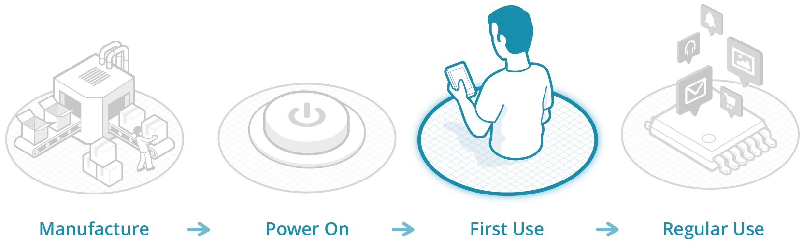

# FAQs

### When is mbed App useful?

The mbed App is intended to be used at the first setup of a device for configuring settings that are common to many types of devices (for example WiFi network configuration), and may subsequently be used to reconfigure a device if the user would like to alter settings during regular use.

The mbed App is not intended to replace a custom application that understands the data generated by your device. A custom domain-specific application is recommended for providing visualisation and domain-specific controls.

### How much does it cost to use mbed App with my product?

Nothing! mbed App is free to use with your product. 

### How are constraints validated?

All constraints for an Intent must be satisfied (AND only, no OR/XOR). Actions have a set of known constraints that are stored in a central [registry](faqs.md#what-is-the-intent-registry). The registry is intended to store a human or semantic description of the action and an icon that represents the action. This allows mbed App to quickly support new actions by importing the corresponding constraints, while also providing a cue for advanced UIs for particular interactions.

### What is the Intent registry?

The Intent registry is a centralised repository that serves a default Constraint Set for an associated Intent action. For example, the Intent registry serves a constraint set that describes the SSID and password fields for connecting to a WiFi network when queried for the `com.arm.connectivity.wifi` action.

The Intent registry is also able to handle localization of titles and descriptions for properties, a job that would otherwise be left to the devices. 

### How do I add an Intent to the Intent registry?

First, check if the registry contains an Intent that matches the action you’re trying to perform. If it does, reuse that. We don’t want to create a lot of duplicates in the Intent registry as this will fragment the experience for end users, with the end result being bad for everyone.

If there isn’t an Intent that matches exactly, but there is one that is close, consider extending that Intent instead of creating an entirely new one. If your changes might be useful to everyone in the future, then consider creating a revised version with a higher version number for inclusion into the registry. 

When your Intent is ready for publication to the registry, email info@mbed.com and we’ll review and publish your Intent (if it's suitable)!

### How do I get the App?

The mbed App is available from the Apple App Store. Currently only iOS is supported. 

### How do I use mbed Privsioning App with mbed OS?

The client library for mbed OS is available via the [Yotta registry](https://yotta.mbed.com/#/module/equip-cpp).

You can find the client library documentation [here](https://github.com/ARMmbed/equip-cpp)

